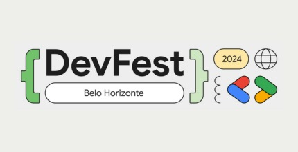
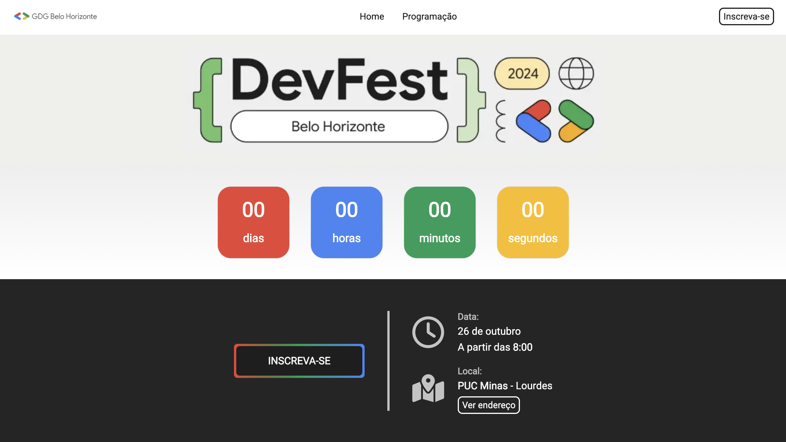
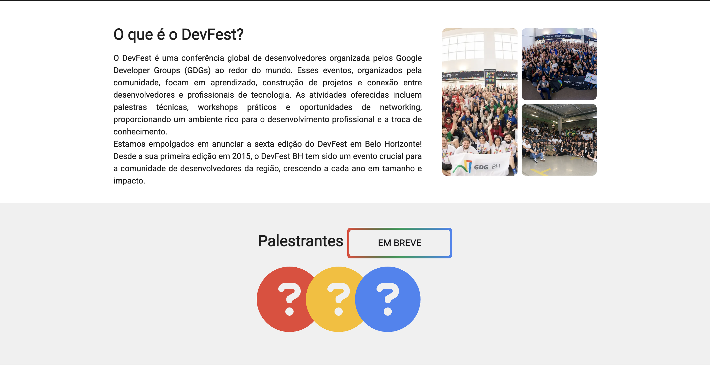
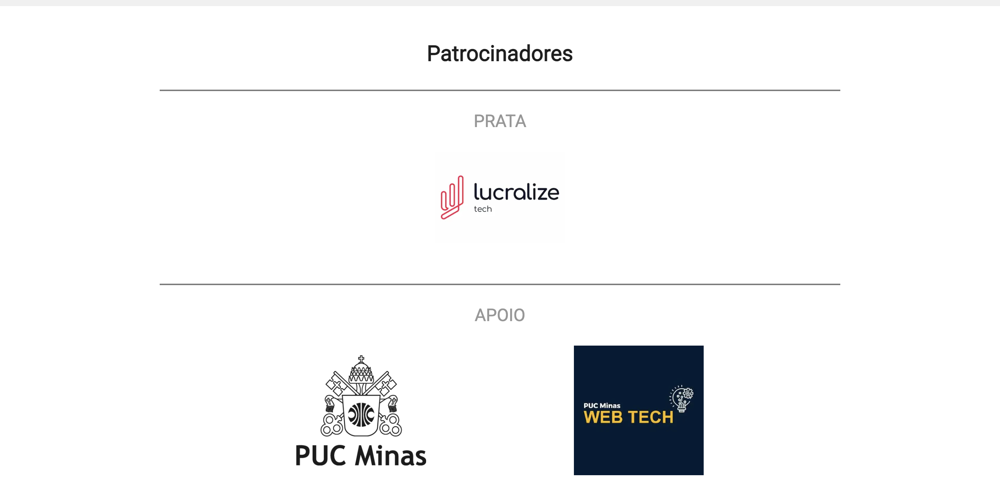
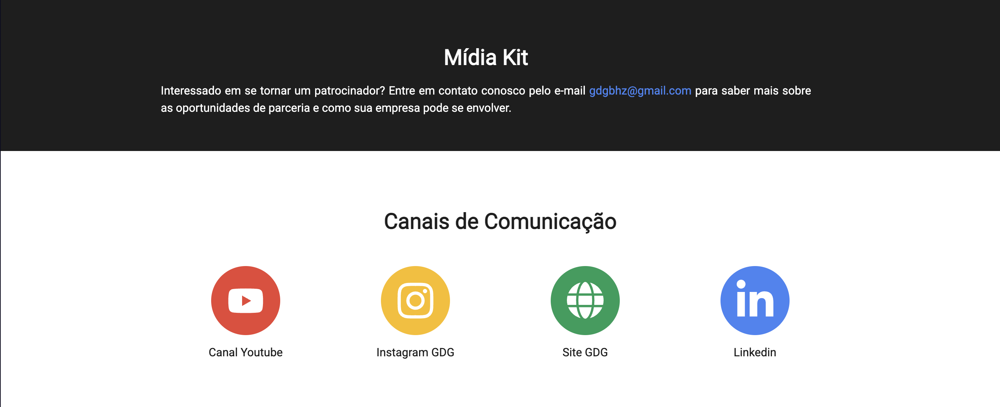
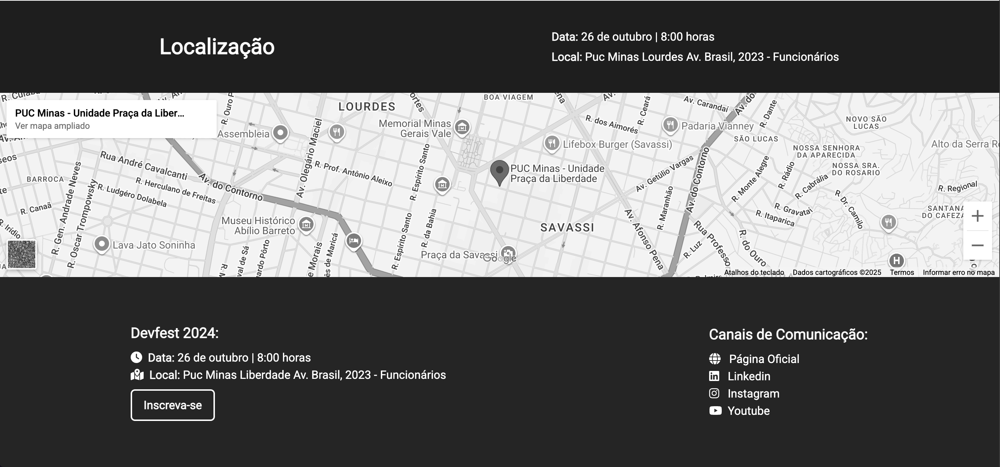
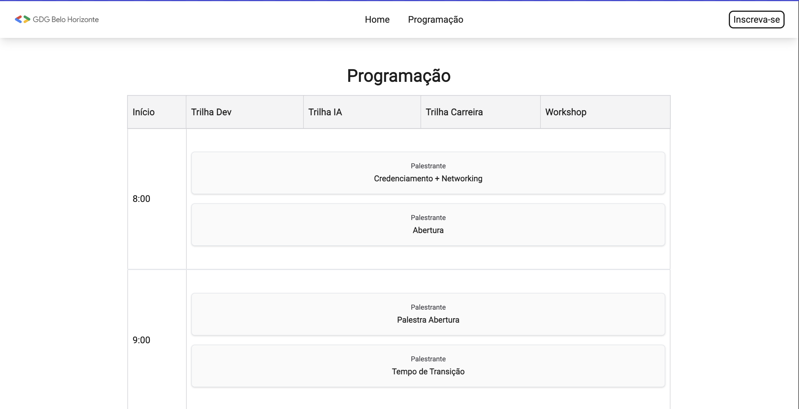

	<h1 align="center">
        DevFest BH 2024 Website
    </h1>
    

        This website was developed by me, together with part of the WebTech Network team, for the Google Developers Group (GDG) Belo Horizonte, supporting the largest technology event in Belo Horizonte, 2024. The site serves as the official platform for the event, providing attendees with all the necessary information, including registration details and the complete event schedule. It was designed to offer a seamless and engaging experience for visitors, ensuring easy access to event updates, sessions, and activities.
    

	

 

    
    
    
    

## 📋 Table of Contents

-   [About](#about)
-   [Table of Contents](#table-of-contents)
-   [Features](#features)
-   [Application Demonstration](#application-demonstration)
-   [How to Access the Application](#how-access-application)
-   [Technologies](#technologies)
-   [Authors](#author)
-   [License](#license)

## 📝 Features

This project was created as the official platform for the GDG Belo Horizonte 2024 event, providing attendees with all the key information and enabling registration. The main functionalities of the platform include directing users to the event registration page, displaying the complete event schedule, showing a countdown to the event, presenting the main partners, and being accessible for both attendees and staff. Within the functionalities, we can have:

-   [x] Event registration page access
-   [x] View complete event schedule
-   [x] Countdown to the event
-   [x] Display main partners
-   [x] Accessible for both attendees and staff

## 📲 Application Demonstration

Below, you will find example images of the application’s front-end, showcasing its main screens and highlighting its interface and core functionalities. The site provides attendees with key information about the event, allows registration, and makes the event schedule easily accessible.

-   Home / Main Section

-   About DevFest

-   Sponsors Section

-   Media Kit & Communication

-   Location

-   Event Schedule

## 🌐 How to Access the Application

This website was developed as the official platform for GDG Belo Horizonte 2024. Since the event has already passed, the site is now hosted solely for demonstration purposes. You can explore the interface, see the event information, and navigate through the main sections of the application.

To view the live demonstration of the site, [click here](https://demo-devfestbh-2024.vercel.app).

## 💻 Technologies

The following tools and frameworks were used in the development of this project:

-   [**Next.js**](https://nextjs.org/docs): A React framework for building fast, SEO-friendly, and server-side rendered web applications.
-   [**React.js**](https://react.dev/learn): A popular JavaScript library for building interactive and component-based user interfaces.
-   [**TypeScript**](https://www.typescriptlang.org/docs): A strongly typed programming language that builds on JavaScript, adding static types and improving code quality.
-   [**Tailwind CSS**](https://tailwindcss.com/docs): A utility-first CSS framework for rapidly styling modern user interfaces.
-   [**Lucide React**](https://lucide.dev/docs/react): A set of customizable and accessible icons for React applications, based on the Lucide icon library.

## 👨🏻‍💻 Authors

---

| [ Artur Bomtempo](https://arturbomtempo.dev/) | [ Mariana Almeida](https://www.marialmeida.site/pt) | [ Nilson Deon](https://www.linkedin.com/in/nilson-deon/) |
| :--------------------------------------------------------------------------------------------------------------------------------------------------: | :--------------------------------------------------------------------------------------------------------------------------------------------------------: | :-------------------------------------------------------------------------------------------------------------------------------------------------------------: |

**Developed by Artur Bomtempo, Mariana Almeida e Nilson Deon 👋🏻. Get in touch:**  

## 📜 License

Copyright (c) 2025 Artur Bomtempo Colen

Permission is hereby granted, free of charge, to any person obtaining a copy
of this software and associated documentation files (the "Software"), to deal
in the Software without restriction, including without limitation the rights
to use, copy, modify, merge, publish, distribute, sublicense, and/or sell
copies of the Software, and to permit persons to whom the Software is
furnished to do so, subject to the following conditions:

The above copyright notice and this permission notice shall be included in all
copies or substantial portions of the Software.

THE SOFTWARE IS PROVIDED "AS IS", WITHOUT WARRANTY OF ANY KIND, EXPRESS OR
IMPLIED, INCLUDING BUT NOT LIMITED TO THE WARRANTIES OF MERCHANTABILITY,
FITNESS FOR A PARTICULAR PURPOSE AND NONINFRINGEMENT. IN NO EVENT SHALL THE
AUTHORS OR COPYRIGHT HOLDERS BE LIABLE FOR ANY CLAIM, DAMAGES OR OTHER
LIABILITY, WHETHER IN AN ACTION OF CONTRACT, TORT OR OTHERWISE, ARISING FROM,
OUT OF OR IN CONNECTION WITH THE SOFTWARE OR THE USE OR OTHER DEALINGS IN THE
SOFTWARE.
